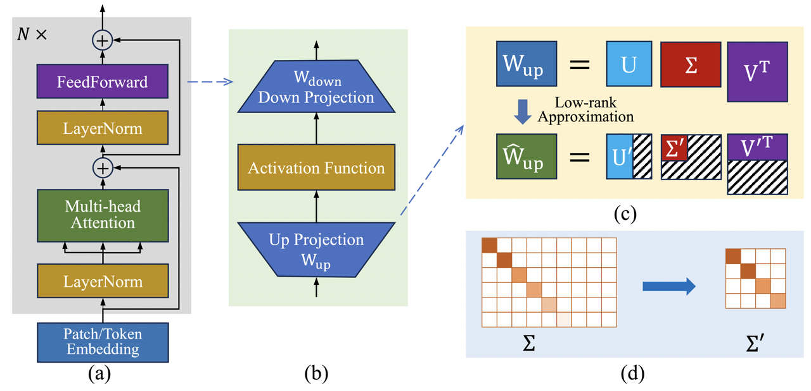

# SeTAR: Out-of-Distribution Detection with Selective Low-Rank Approximation

The official implementation of the paper [SeTAR: Out-of-Distribution Detection with Selective Low-Rank Approximation](https://arxiv.org/abs/2406.12629).



## Abstract

Out-of-distribution (OOD) detection is crucial for the safe deployment of neural networks. Existing CLIP-based approaches perform OOD detection by devising novel scoring functions or sophisticated fine-tuning methods. In this work, we propose SeTAR, a novel, training-free OOD detection method that leverages selective low-rank approximation of weight matrices in vision-language and vision-only models. SeTAR enhances OOD detection via post-hoc modification of the model’s weight matrices using a simple greedy search algorithm. Based on SeTAR, we further propose SeTAR+FT, a fine-tuning extension optimizing model performance for OOD detection tasks. Extensive evaluations on ImageNet1K and Pascal-VOC benchmarks show SeTAR’s superior performance, reducing the false positive rate by up to 18.95% and 36.80% compared to zero-shot and fine-tuning baselines. Ablation studies further validate our approach’s effectiveness, robustness, and generalizability across different model backbones. Our work offers a scalable, efficient solution for OOD detection, setting a new state-of-the-art in this area.

## Table of Contents

- [Environment Setup](#environment-setup)
- [Datasets](#datasets)
- [Experiments](#experiments)
- [Acknowledgement](#acknowledgement)
- [Citation](#citation)


# Environment Setup

We run the experiments on a single NVIDIA 4090 GPU with 24GB memory. The code is developed and tested on Ubuntu 20.04.6 with Python 3.10 and CUDA11.8.

To install the required packages, please follow the instructions below.

```bash
conda create -n svd_ood python=3.10 -y
conda activate svd_ood

# Install dependencies
pip install torch==2.0.1 torchvision transformers==4.37.2 datasets scipy scikit-learn matplotlib seaborn pandas tqdm ftfy timm tensorboard

# Install SVD_OOD
cd src/svd_ood
pip install -e .

# Install peft-0.10.1.dev0 from source, accelerate also installed
cd ../peft
pip install -e .
```

> For peft, we implement the [modified_lora](src/peft/peft/tuners/modified_lora) to specified rank at each layer. Refer to [test.py](src/peft/peft/tuners/modified_lora/test.py) for a simple example.

# Datasets

Please follow this [instruction](./data/README.md) to download and preprocess the datasets.

# Experiments

> We provide all the experiment settings in the [configs](./configs/) folder, refer to [configs/README.md](./configs/README.md) for more details. Please change the `data_root` in the config file to your datasets path before running the experiments.

- To run the training-free SeTAR on ImageNet1K as In-Distribution (ID) dataset with CLIP-base, run the following command. We provide the output in [results](results/training-free/clip_base/ID_ImageNet1K/SeTAR) folder.

    ```bash
    python search.py --config_file "configs/training_free/clip_base/ID_ImageNet/SeTAR.json"
    ```


- To run the fine-tuning SeTAR+FT on ImageNet1K as In-Distribution (ID) dataset with CLIP-base, run the following command. We provide the output with seed 5 in [results](results/finetune/clip_base/ID_ImageNet1K/SeTAR+FT) folder. You may change the seed to reproduce the average results.

    ```bash
    python finetune.py --config_file "configs/finetune/clip_base/ID_ImageNet1K/SeTAR+FT.json"
    ```


# Acknowledgement

The code is based on the following repositories, we greatly appreciate the authors for their contributions.

- [CLIP](https://github.com/openai/CLIP/tree/main) (commit [a1d0717](https://github.com/openai/CLIP/tree/a1d071733d7111c9c014f024669f959182114e33/clip)): a neural network model by OpenAI for image-text tasks, jointly learning from text and image data.
- [MCM](https://github.com/deeplearning-wisc/MCM) (commit [640657e](https://github.com/deeplearning-wisc/MCM/tree/640657ea67cb961045e0999301a6b8101dad65ba)): proposes Maximum Concept Matching (MCM), a zero-shot OOD detection method based on aligning visual features with textual concepts.
- [GL-MCM](https://github.com/atsumiyai/gl-mcm) (commit [dfcbdda](https://github.com/AtsuMiyai/GL-MCM/tree/dfcbddac2533e26f2ff16c1762c0965fc305f703)): proposes Global-Local Maximum Concept Matching (GL-MCM), based on both global and local visual-text alignments of CLIP features.
- [LoCoOp](https://github.com/AtsuMiyai/LoCoOp) (commit [d4c7ca8](https://github.com/AtsuMiyai/LoCoOp/tree/d4c7ca8534a09091aa4de37c4edd938a06d5bb6f)): proposes Local regularized Context Optimization (LoCoOp), which performs OOD regularization that utilizes the portions of CLIP local features as OOD features during training.


# License

This project is licensed under the MIT License.


# Citation

If you find this code useful, please consider citing our paper:

```bibtex
@misc{li2024setar,
      title={SeTAR: Out-of-Distribution Detection with Selective Low-Rank Approximation},
      author={Yixia Li and Boya Xiong and Guanhua Chen and Yun Chen},
      year={2024},
      eprint={2406.12629},
      archivePrefix={arXiv}
}
```